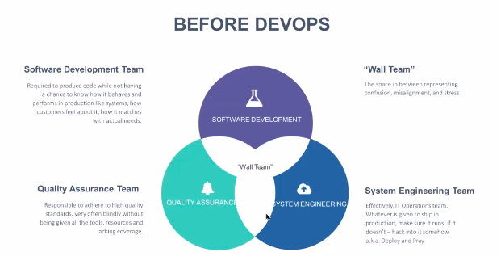
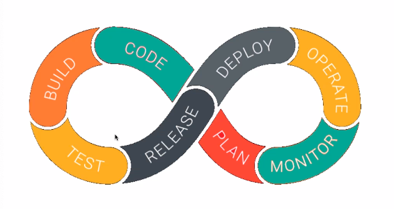
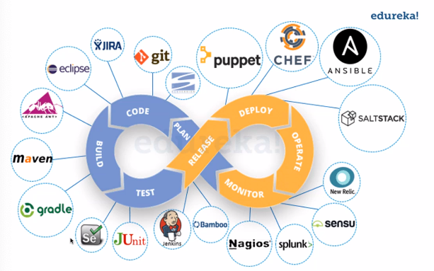
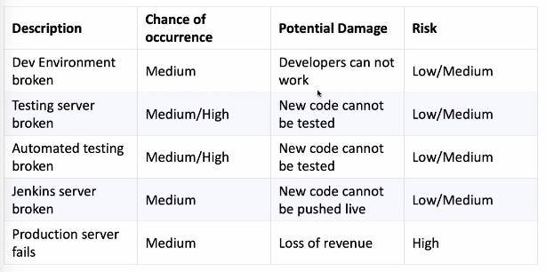
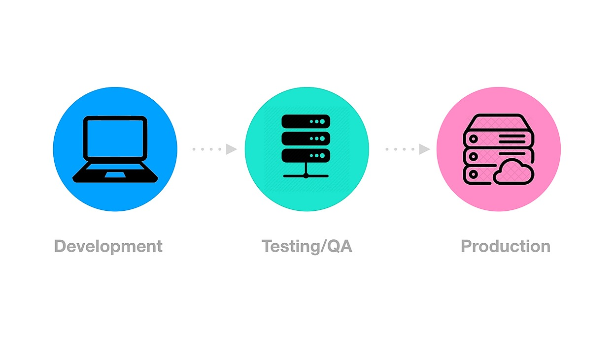

# DevOps
### Contents 
* **History of DevOps**
* **Why do we need DevOps?**
* **What is DevOps**
* **DevOps Lifecycle**
* **DevOps Implementation**
* **Risk Register**
* **Dev Environments** 


## History of DevOps and Infrastructure
* Software Dev and Operations in the past:
  * Updates took longer to role out
  * Physical and hard obstacles - first bug was an actual bug 
  * Bugs took longer to fix
  * Feedback loop took longer
  * Slow 
* If you want to build a computer... Considerations:
  * What mother board?
  * How much memory?
  * What OS do you want to run on -linux, Windows, Mac OS
     * What linux distribution - ubuntu 
  * Do you want  a virtual machine
  * What IP address are you going to set it to?
  * Staff to maintain data centres- developers, operations teams, cleaners etc. 
* **Development was hard. Operations were hard**

## What is DevOps
* Many definitions of DevOps:
  * A **collaboration** of Development(Dev) and Operations(Ops) 
  * A **culture** which promotes collaboration between development and operations teams to deploy code production faster in an automated and repeatable way.
  * A **practice** of development and operation engineers taking part together in the whole service lifecycle.
  * An **approach** through which superior quality software can be developed quickly and with more IT reliability.
  * An **alignment** of development and IT operations with better communication and collaboration 
  * A **set of practices** intended to reduce the time between committing  change to a system and the change being placed into normal production, while ensuring high quality



## The 4 Pillars of DevOps
1. Ease of use
2. Flexibility
3. Robustness
4. Cost 

## DevOps Lifecycle
**Continuous Development**
Continuous Testing
**Continuous Integration**
Continuous Deployment
Continuous Delivery 
Continuous Monitoring 



## DevOps Implementations
* Cloud Platform 
  * AWS
  * GCP
  * Azure
* Infrastructure Architecture
  * Virtualization
  * Containerisation (Docker)
* DevOps Implementations
  * Infrastructure as a Code (IaaC)
  * Infrastructure as a Service (IaaS)
  * Infrastructure as a Platform (IaaP)
  * Infrastrutcure as a Product 
## DevOps Tools

  
## Risk Register 
A typical risk register may look like this:   


## Dev Environments
### What are the different environments?
* An environment is where code runs. 
* GitHUB is not an environment as code does not run here 
* PyCharm is an environment creates its own virtual environments ```venv```. The purpose of this is **robustness** and **flexibility** 
* Likewise the Terminal is also an environment. 
* 3 main environments 
   1. Dev Environment 
   2. Test Environment 
   3. Deployment /Live Environment 
* Code will move between these three environments 



  
 


